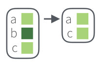
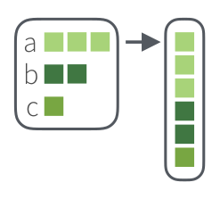

```{r, echo=FALSE}
library(qrcode)
qrcode_gen('https://agricolamz.github.io/2019.12.21_EU_purrr/index.html')
```

```{r setup, include=FALSE}
knitr::opts_chunk$set(fig.width=12, fig.height=9)
```

```{r, message=FALSE}
library(tidyverse)
```

## Что такое списки?
Допустим, вы забыли, что такое список:

```{r}
x <- list(m = "a", n = c(2, 4), o = c("blue", "green", "red"))
x
x$m
x[1]
x[[2]]
x[[2]][2]
```


Списки вне R обычно хранят в файлах типа `.json` (по-английски говорят с ударением на первый слог, а вот по-русски прижился вариант с ударением на второй слог: джейсо́н) или `.xml` (мы обсудим только `.json`).

### Превращение JSON в список и обратно
Самое важное, что нужно знать, про `.json`, это то, что там могут хранится:

* пары ключ и значение, заключенные в фигурные скобки `{"ключ":"значение"}`
* упорядочные множества значений, заключенные в квадратные скобки `["значение_1","значение_2",...]`
* некоторые другие типы данных

Чтение и запись `.json` файлов осуществляется при помощи пакета `jsonlite` (не входит в `tidyverse`). Для примера скачаем датасет 30 героев Игры престолов, который  Дж. Р. Р. Мартин достал с ресурса [An API of Ice And Fire](https://anapioficeandfire.com/).

```{r}
got_chars <- jsonlite::read_json("https://raw.githubusercontent.com/agricolamz/2019.12.21_EU_purrr/master/data/got_chars.json")
got_chars[1]
```

Так как `jsonlite` конфликтует в одной функции с `tidyverse`, я не загружаю библиотеку полностью при помощи команды `library(jsonlite)`, а обращаюсь к функциям пакета при помощи выражения `jsonlite::...()`. Пакет `jsonlite` позволяет записывать `.json` файлы при помощи функции `write_json()`:

```{r, eval=FALSE}
jsonlite::write_json(got_chars, "got_chars.json", auto_unbox = TRUE)
# аргумент auto_unbox позволяет сохранять структуру, которую мы видим в R
```

### Просмотр списков в R 

Просмоторщик списков встроен в RStudio. Его можно увидеть, если ткнуть в объект в R или написать команду `View(got_chars)`. Альтернативой может стать функция `jsonedit()` из пакета `listviewer`. Кроме того, что-то можно попробовать выяснить, используя функцию `str()`.

```{r}
str(got_chars[1])
str(got_chars[1], max.level = 2)
```

## Пакет `purrr`

В `tidyverse` встроен пакет `purrr`, который среди прочего позволяет работать со списками. Существует [cheat sheet по `purrr`](https://github.com/rstudio/cheatsheets/raw/master/purrr.pdf). Ну и конечно полный [туториал](https://jennybc.github.io/purrr-tutorial/index.html).

### Функция `map()` и `map...()`
Можно выводить значения в списке на основе имени:

```{r}
got_chars %>% 
  map("name")
```

Можно выводить значения в списке на основе индекса:

```{r}
got_chars %>% 
  map(3)
```

Достаточно полезно знать о функции `unlist()`, которая "убивает" все сложную структуру:

```{r}
got_chars %>% 
  map("name") %>% 
  unlist()
```

Для этого есть и отдельные функции, которые позволяют превратить все в вектор заданного типа:
```{r}
got_chars %>% 
  map_chr("name")
got_chars %>% 
  map_int("id")
got_chars %>% 
  map_lgl("alive")
```

Можно даже создать новый датафрейм:
```{r}
got_chars %>% 
  tibble(name = map_chr(., "name"), # точка обозначает, в какой аргумент должно все пайпиться
         id = map_dbl(., "id"),
         alive = map_lgl(., "alive"))
```
  
Также существует способ создание датафреймов на основе вектора значений при помощи функции `enframe()`:

```{r}
got_chars %>% 
  map_chr("name") %>% 
  enframe()
```

#### Задание 1

Скачайте [частотный словарь русского языка [Шаров, Ляшевская 2011] (он храниться в `.tsv`)](https://raw.githubusercontent.com/agricolamz/DS_for_DH/master/data/freq_dict_2011.csv), разбейте столбец `lemma` на буквы при помощи функции `str_split(dict$lemma, "")`, а на основе полученного списка постройте график, на котором изображено, сколько раз встретилась какая буква:

```{r, echo=FALSE, message=FALSE}
dict <- read_tsv("https://raw.githubusercontent.com/agricolamz/DS_for_DH/master/data/freq_dict_2011.csv")

str_split(dict$lemma, "") %>% 
  unlist() %>%  
  enframe() %>% 
  mutate(value = str_to_lower(value)) %>% 
  filter(str_detect(value, "\\w")) %>% 
  count(value, sort = TRUE) %>% 
  ggplot(aes(fct_reorder(value, n), n))+
  geom_col()+
  coord_flip()+
  labs(x = "", y = "", caption = "данные из [Ляшевская, Шаров 2011]")
```

<details> <summary> 📋 список подсказок ➡ </summary> 
<details> <summary> 👁 `tidyverse` включили? ➡ </summary>
`library(tidyverse)`.
<br>
</details>
<details> <summary> 👁 `.tsv`? Почему словарь скачивается как один столбец? ➡ </summary>
`.tsv` --- это как `.csv`, только в качестве разделителя не запятая, а табуляция (`\t`). Попробуйте использовать другой разделитель или функцию `read_tsv()` из пакета `readr` (входит в `tidyverse`).
<br>
</details>
<details> <summary> 👁 Почему словарь как-то криво скачивается? ➡ </summary>
Cкорее всего полетела кодировка. Я все делаю в UTF-8, так что либо поменяйте кодировку в функции, которую Вы используете, либо исполбзуйте функцию `read_tsv()` из пакета `readr` (входит в `tidyverse`) --- она сама борется с кодировками.
<br>
</details>

<details> <summary> 👁 Получился список. А-а-а-а! Как его убрать? ➡ </summary>
Это простой случай, так что в каком-то смысле списочная структура не очень нужна. Так что можно просто `unlist()`.
<br>
</details>

<details> <summary> 👁 Я получил вектор. А что дальше? ➡ </summary>
В принципе, график `ggplot2` требует на вход датафрейм, так что его можно сделать при помощи чего угодно. Я использовал `enframe()`.
<br>
</details>

<details> <summary> 👁 Какие-то буквы большие, какие-то маленькие... Что делать? ➡ </summary>
Существует много способов привести все к строчным буквам: `tolower("ВАША СТРОКА")` из базого R, или `str_to_lower()` из пакета `stringr` (входит в `tidyverse`).
<br>
</details>

<details> <summary> 👁 А как убрать дефис и апостроф? ➡ </summary>
Ну во-первых, что-то нужно убрать, а что-то оставить --- значит нужна функция `filter()` из пакета `dplyr`. А дальше уже вопрос техники: можно использовать констуркцию `value != "-"`. А можно убить двух зайцев одним выстрелом и использовать регулярку: `filter(str_detect(value, "\\w"))`.
<br>
</details>

<details> <summary> 👁 А как посчитать кого сколько? ➡ </summary>
Для этого можно использовать функцию `count()`. Можно было вообще не считать и использовать `geom_bar()`, но тогда не получиться отсортировать по возрастанию.
<br>
</details>

<details> <summary> 👁 А какой `geom_` использовать? ➡ </summary>
Я использовал `geom_col()`. Можно еще использовать `geom_bar()` на неагрегированных данных, но тогда не удастся отсортировать.
<br>
</details>

<details> <summary> 👁 А как перевернуть оси? ➡ </summary>
Добавьте `coord_flip()` к объекту `ggplot`.
<br>
</details>

<details> <summary> 👁 А как отсортировать по возрастанию? ➡ </summary>
Для этого нужно превратить переменную в фактор с правильным порядком. Я это обычно делаю при помощи функции `fct_reorder()` из пакета `forcats` (входит в `tidyverse`) уже в `ggplot()`: `data %>% ggplot(aes(x = fct_reorder(value, n), y = n)) + ...`.
<br>
</details>
</details>

#### Задание 2 (домой)
В датасете, собранный [Adithya Ganesh](https://www.kaggle.com/adithyarganesh/english-premier-league-player-data-20182019#fpl_data_2018_2019.json), хранится информация об играках Английской Премьер-лиги. На основании этих данных (лежат в папке `data`) постройте график 30 игроков, которые забили больше всего голов и раскрасьте на основании их футбольного клуба.


```{r, echo=FALSE, message=FALSE}
fpl <- jsonlite::read_json("https://raw.githubusercontent.com/r-classes/2019_2020_ds4dh_hw3_purr_gutenbergr_tidytext_udpipe/master/data/fpl_data_2018_2019.json")
fpl %>% 
  tibble(name = names(fpl),
         club = map_chr(., "Club"),
         goals = map_chr(., "Goals")) %>% 
  mutate(goals = as.integer(goals)) %>% 
  arrange(-goals) %>% 
  slice(1:30) %>% 
  ggplot(aes(fct_reorder(name, goals), goals, fill = club))+
  geom_col()+
  coord_flip()+
  labs(x = "", y = "", title = "Number of Goals", caption = "data from www.premierleague.com")
```

### Фильтрация списков

Если в списке есть логические выражения, их можно использовать как фильтры. Например, вот так мы оставим только живых героев:
```{r}
got_chars %>% 
  keep("alive") %>% 
  map_chr("name")
```



А так -- только мертвых:
```{r}
got_chars %>% 
  discard("alive") %>% 
  map_chr("name")
```


Также есть особый фильтр `head_while()` и `tail_while()`, который выделяет единицы (с начала и конца) до первого `FALSE`.

```{r}
got_chars %>% 
  head_while("alive") %>% 
  map_chr("name")

got_chars %>% 
  tail_while("alive") %>% 
  map_chr("name")
```


Если все еще не понятно, взгляните на нашу таблицу:
```{r}
got_chars %>% 
  tibble(name = map_chr(., "name"), # точка обозначает, в какой аргумент должно все пайпиться
         alive = map_lgl(., "alive"))
```

### Операции со списками

Рассмотрим простой пример:

```{r}
my_l <- list(a = 1:3, b = c("a", "b"), c = list("z", c(8, 9)))
my_l
```

Как уже говорилось выше, функция `unlist()` линеаризует списки, превращая их в векторы:

```{r}
my_l %>% 
  unlist()
```

Получился поименнованный вектор, если этого недостаточно, можно уничтожить и имена при помощи функции `unname()`:

```{r}
my_l %>% 
  unlist() %>% 
  unname()
```

Функция `flatten` позволяет уничтожить **лишь один, верхний,**, уровень иерархии:
```{r}
my_l %>% 
  flatten()
```



Как видно из этого примера, первый элемент списка `my_l` превратился в три первых элемента списка, а вот подсписок `c = list("z", c(8, 9))` превратился в элемент `z` и вектор `c(8, 9)`.

Существуют также функции `append()` и `prepend()`, которые позволяют добавлять новый посписок после (или до) старого:

```{r}
list(c(1, 2), c("a", "b", "c")) %>% 
  append(list(new = c(TRUE, FALSE)))
list(c(1, 2), c("a", "b", "c")) %>% 
  prepend(list(new = c(TRUE, FALSE)))
```

Существует также функции `cross()` и `cross2()`, которые позволяют получить уникальные комбинации объектов из двух списков:
```{r}
list(c("a", "b"), 1:3) %>% 
  cross() %>% 
  str()

list("a", "b") %>% 
  cross2(1:3) %>% 
  str()
```

## Ребрендинг функции `map()`

На самом деле все функции `map()` --- являются циклами со следующей структурой:

```
map(you_object, your_function)
```

Это значит, что мы можем использовать `map()`

* для изменения значений в одном из векторов датафрейма

```{r}
diamonds %>% 
  mutate(price_rubl = map_dbl(price, function(x){x*62.24}))

# сравните!
# diamonds %>% 
#   mutate(price_rubl = price*62.24)
```

* для работы с кучей файлов

В датасетах содержаться информация об объектах, выданных библиотекой Сиэтла 100 и более раз (исходные данные доступны [здесь](https://data.seattle.gov/dataset/Checkouts-by-Title-Physical-Items-/3h5r-qv5w)). Датасет состоит из кучи `.csv` файлов с 5 переменными:

* `id` -- идентификационный номер объекта
* `type` -- тип объекта (`bk` -- книга, `bknh` -- другая категория с книгами, `cas` -- кассеты, `cd` -- CD, `dvd` -- DVD, `kit` -- комплект (я сам пока не разобрался что там...), `vhs` -- видеокассеты VHS)
* `name` -- название
* `n` -- сколько раз взяли в том или иному году
* `year` -- год

Данные лежат вот здесь:

* https://raw.githubusercontent.com/agricolamz/2019.12.21_EU_purrr/master/data/seattle_public_library_2005.csv
* https://raw.githubusercontent.com/agricolamz/2019.12.21_EU_purrr/master/data/seattle_public_library_2006.csv
* ...
* https://raw.githubusercontent.com/agricolamz/2019.12.21_EU_purrr/master/data/seattle_public_library_2019.csv

Давайте считаем их все:

```{r, message=FALSE}
links <- str_c("https://raw.githubusercontent.com/agricolamz/2019.12.21_EU_purrr/master/data/seattle_public_library_", 2005:2019, ".csv")

df <- map(links, read_csv)
str(df, max.level = 1)
```


Можно даже соединить их в один датафрейм:

```{r, message=FALSE}
df_2 <- map_dfr(links, read_csv)
df_2
df_2 %>%
  group_by(type, name) %>%
  summarise(sum_n = sum(n))  %>%
  ungroup() %>%
  arrange(-sum_n) %>%
  slice(1:100) %>%
  ggplot(aes(fct_reorder(str_trunc(name, 40), sum_n), sum_n, fill = type))+
  geom_col()+
  coord_flip()+
  labs(x = "", y = "",
       title = "Most popular physical item checkouts from Seattle Public Library (2005-2019)",
       caption = "data from https://data.seattle.gov/dataset/Checkouts-by-Title-Physical-Items-/3h5r-qv5w")
```

